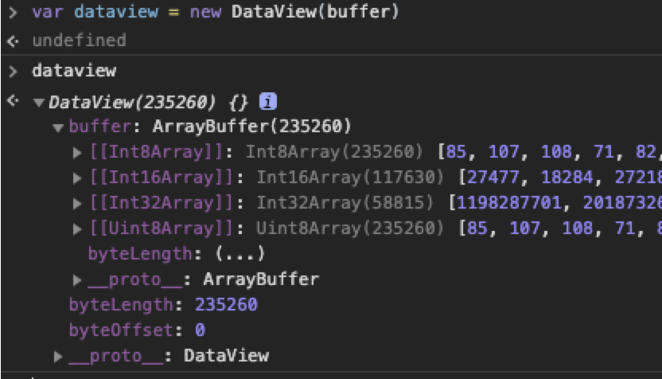

### To convert int8Arry from Backend-server to ArrayBuffer

#### Response
```bash
# response
data = "UklGRjSxAgBXQVZFZm10IBAAAAABAAIARKwAABCxAgAEABAAZGF0YRCxAgA0/xcAF/8gAEH/IgA5/yI..."
```

```javascript
// Convert data to ascii
const int8Arr = []
data.split("").forEach((char) => {
  int8Arr.push(char.charCodeAt(0))
})

var buffer = new Int8Array(int8Arr).buffer
var dataview = new DataView(buffer)
```

